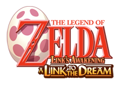

# Zelda: A Link to the Dream

This package contains the data files of the Solarus quest *The Legend of Zelda: A Link to the Dream*. This game is a remake of the original Nintendo Game Boy game *The Legend of Zelda: Link's Awakening (DX)*.

This quest is a free, open-source game that works with Solarus, a free and open-source Action-RPG 2D game engine. See the [Solarus website](https://www.solarus-games.org) to get more information and install Solarus.

- **Release Date:** TBA
- **Players:** 1
- **Length:** 20 hours
- **License:** Copyright, CC BY-SA 4.0, GPL v3
- **Languages:** French


## Synopsis

After a violent storm while he was navigating on the sea, Link finds himself on Koholint Island. To escape, he needs to find the Instruments of the Sirens, which will awaken the Wind Fish and allow Link to leave the island he is marooned on. 


## How to play

Installing the game is not needed to play it.

### Solarus Launcher

The easiest way is by using Solarus Launcher, the GUI made to manage and play Solarus quests. Launch it, and then add this quest with the menu **File > Add a quest...** and select the folder `zelda-alttd`. Then, select this game in the list, and click on **Play** (shortcut **F5**).


### Command Line

Assuming the directory `zelda-alttd` contains either a subdirectory `data` or a `data.solarus` archive, and that Solarus is installed, type the following line in the console:

```
$ solarus-run path/to/zelda-alttd
```


## How to install

### Install the quest

First, generate the `data.solarus` archive, that will contain all data files for the quest, by typing this:

```
$ cd path/to/zelda-alttd
$ cmake .
$ make
```

**NB:** Add the parameter `-D CMAKE_INSTALL_PREFIX=/home/your_directory` to `cmake` if you want to change the install directory, which is `/usr/local/` (e.g. to a place where no root access is necessary).

Then, to install the quest, type:

```
$ make install
```

This will install the following files:

- The quest data archive `data.solarus` in `/usr/local/share/solarus/zelda-alttd/`
- A script called `zelda-alttd` in `/usr/local/bin/`


### Run the quest

The `zelda-alttd` script launches `solarus` with the appropriate command-line argument to specify the quest path. This means that you can launch the `zelda-alttd` quest directly with the command:

```
$ zelda-alttd
```

which is equivalent to:

```
$ solarus-run /usr/local/share/solarus/zelda-alttd
```
